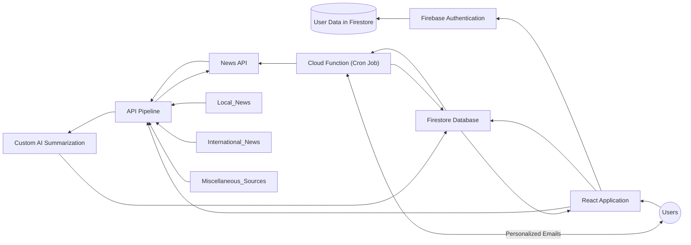
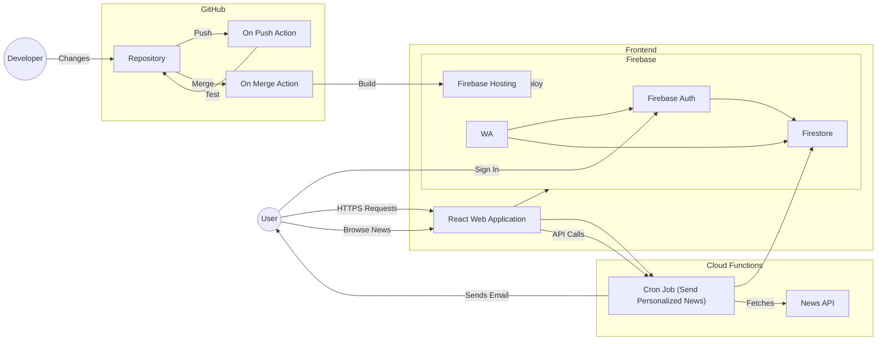

# Newsify: A News Aggregator Application

**Newsify** is a news aggregator application designed to enhance community awareness by curating and sharing news from verified local sources. This project is a solution to the problem statement provided in the **News and Information Track**, aimed at delivering accurate, relevant, and personalized news to users.

---

## Features

### 1. Aggregation from Verified Sources
Newsify uses the **newsdata.io API** to collect news exclusively from verified local sources, ensuring the authenticity and reliability of the information shared.

### 2. Content Categorization
News articles are categorized into various topics such as politics, technology, health, sports, entertainment, and more, allowing users to easily navigate and explore their interests.

### 3. Personalized News Feeds
The application provides users with a personalized news feed by leveraging their previous interactions with the platform. Personalized content is based on:
- Articles previously viewed.
- User Expressions to the articles.

### 4. Reaction Feature
Users can react to news articles using a predefined set of emojis. These reactions contribute to the personalization of their news feed by analyzing user preferences based on their chosen emojis, enhancing the user experience.

### 5. Text-to-Audio Feature
Newsify incorporates a **text-to-audio** feature, enabling users to listen to news articles, making the app accessible to visually impaired users or those who prefer an audio format.

### 6. AI-Powered Summarization
The application uses **AI summarization** to generate concise summaries of news articles, helping users quickly grasp the essence of the content without reading lengthy texts.

---

## Technology Stack

- **API**: [newsdata.io](https://newsdata.io/)
- **Frontend**: React.js,Tailwind CSS
- **Backend**: Node.js 
- **AI Summarization**: Gemini-1.5-pro-latest
- **DataBase**: NoSQL(Firestore)
- **Text-to-Audio**: ResponsiveVoice JS

---

## How to Run the Application

1. **Clone the Repository**  
   ```bash
   git clone https://github.com/Sherma-ThangamS/KYN_Hackathon.git
   cd KYN_Hackathon
   ```
   
2. **Install Dependencies**  
    ```bash
    npm install
    ```

3. **Set Up Environment Variables**  
    Create a `.env` file and include the following:  
    ```bash
    REACT_APP_GEM_API=Your_Gemini_API_Key
    REACT_APP_NEWS_DATA_API_KEY=Your_News_Data_API_Key
    ```
    
4. **(Optional) Update Firebase Configuration**  
    If you're using your own Firebase project, update the `firebase.js` file with your Firebase configuration:  
    ```javascript
    const firebaseConfig = {
      apiKey: "Your_API_Key",
      authDomain: "Your_Project_Auth_Domain",
      projectId: "Your_Project_ID",
      storageBucket: "Your_Storage_Bucket",
      messagingSenderId: "Your_Messaging_Sender_ID",
      appId: "Your_App_ID",
    };

    ```

5. **Start the Application**  
    ```bash
    npm start
    ```

6. **Access the Application**  
    Open your browser and navigate to `http://localhost:3000` (or the specified port).

--- 

## Architecture Diagram 


## High Level Design

---
## Screenshots


